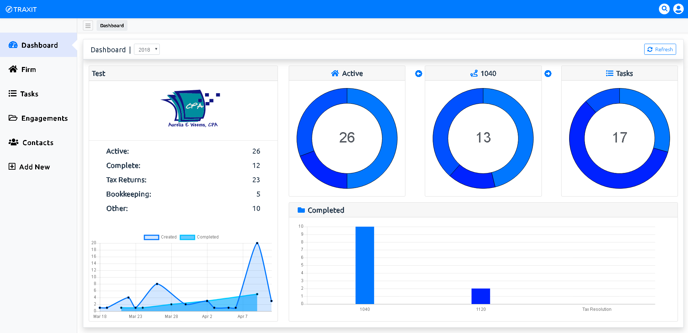

Giving a visual representation of the data you have flowing through your firm or business is great for quick decision making and a high level overview of what is happening. The below image should give you an idea of what TRAXIT is tracking.

### The Breakdown

* Active
    * The active chart gives a overall breakdown of the current active engagements. Each color inside the doughnut represents the different workflows currently active. Hovering over the color will give you the total engagements of that workflow. The number in the middle represents the total of engagements in all workflows.
* Workflow
    * The workflow chart gives you the ability to tab through each workflow, with each color representing the breakdown of engagements by there current status. The title of the chart is taken from the name of the workflow so that you know which workflow you are currently viewing. This gives you a visual representation of where there could be a bottle neck or where attention should be focused.
* Tasks
    * The tasks chart shows you a breakdown of your currently assigned tasks. Each task is attached to an engagement with the status representing the task needing to be complete. The color breakdown of the tasks chart represents the different tasks currently assigned.
* Completed
    * The completed chart found at the bottom right of the image, shows a breakdown of completed engagements in each workflow. The completed engagements can be filtered by year.
* Created vs. Completed
    * The created/completed chart to the bottom left of the image, shows a timespan of created engagements vs. completed engagements. This can give you an idea of when you are receiving documents vs. the time it is taking to complete the job.
