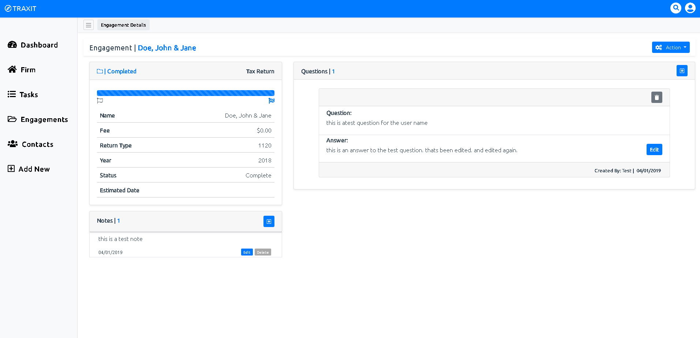

Engagements are what is being processed. For instance if you do a 1040 tax return, that would be considered an engagement. Consider it to be the connection between you and your clients. Each engagement will also contains specific details and questions that can be viewed at anytime.

### The Breakdown

* The Engagement
    * This can be considered the the "job" or the "project". It can be imagened as a folder containng documents, conversations and or notes between you and your customer. It's job is to virtually track the current condition of the job or project. Each engagement unless "complete" will be assigned to a user of TRAXIT.

* The Engagement Details
    * The engagement will store miscallaneous data such as.
        * The Name
        * The Fee for the job
        * The Return Type of the engagement
        * The year that the engagement is for
        * The current status of the engagement
        * The estimated date of completion based on level of complexity.
    
* The Engagment Questions
    * This feature is used to track the conversations between you and your customer. Also not seen here is the ability to email the client the list of questions from within the application. This limits the redundancy of tasks, and allows you to complete multiple tasks at the same time.
    * Also once answers have been provided, simply attach them to the associated question so for a later date you can easily look up what was said in the conversation.

* The Engagement Notes
    * This feature allows you to make miscellaneous notes about the engagement and can be used as you see fit.