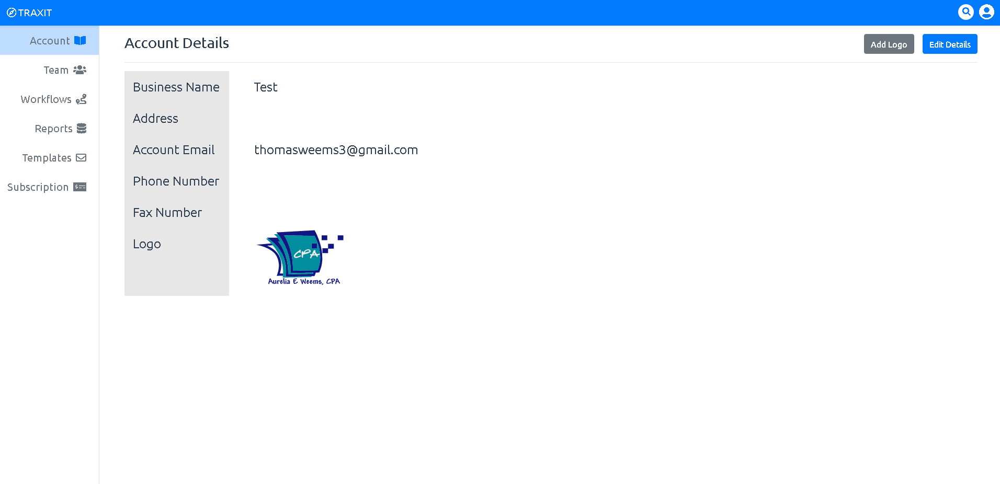

We wanted this tool to be flexible so you have the ability to manage your own workflows, team members, and reports all from the admin dashboard. Only abled to be view by admins, this will be only accessed to those you choose to allow.

### The Breakdown

* The Management Overview
    * This can be considered the admin panel for TRAXIT. Available only to users with the role "Admin", you will have the ability to manage the following
        * Account Details
        * Team Members
        * Workflows
        * Reports
        * Email Templates
        * Subscription Details

    * Account details are not necessary however they are used when sending emails.
    * Team members are who you add to the group of users.
    * Workflows as discussed earlier will be the backbone management of your process.
    * Reports will be used to pull data about current and past engagments, in a number of ways.
    * Email Templates are the formatting of emails used to start conversations and alert customers/clients.
    * Subscription details is your ability to update credit card information and view invoices.