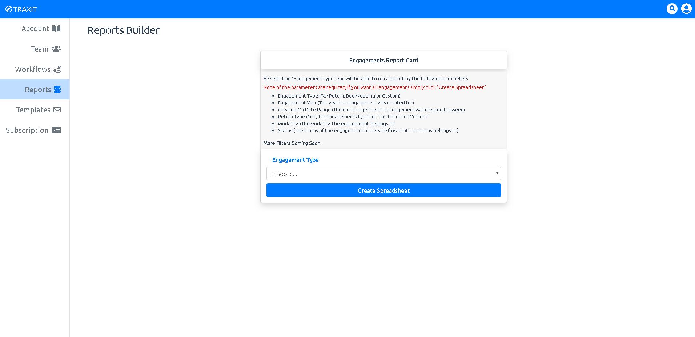

The ability to run reports is another great tool for making decisions. One example would be to know the amount of certain tax returns that were processed in the year 2018. Or how many tax returns were completed in 2017 vs the amount in 2018.

### The Breakdown

* You will currently be able to run reports on the following
    * By clicking the "Create Spreadsheet" button you will create a excel spread sheet based on the parameters you provide which are as follows;
        * Engagement Type
        * Engagement Year
        * Created On Date Range
        * Return Type
        * Workflow
        * Status