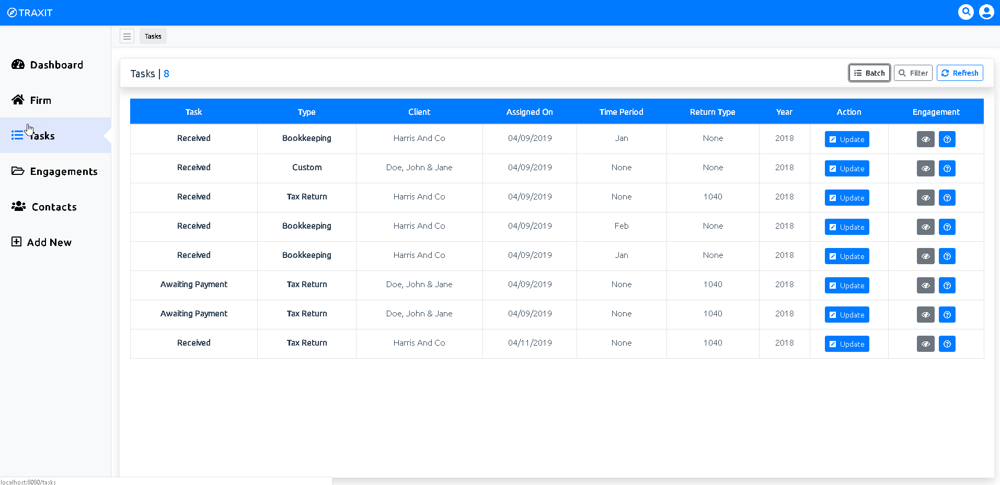

This is great to keep everyone informed on what is needed to be done. And more specifically what each team member has assigned. Each team member will have there own tasks. Each task is related to the processing of an engagement.

### The Breakdown

* The Task List
    * Each task in your list represents an engagement needing your attention. The intention of the first column "Task" is to tell you what exactly you are needing to do on that job. Also shown are the "Type" of engagement, the client, along with other miscellaneous data.
    * You will also see a button under the "Action" column called "Update". Clicking this will bring up a window allowing you to easily move the engagement to the next status/user to be assigned or complete entirely, and once moved you will no longer see the task in your task list. Also you will notice the "batch" button on the right corner that will allow you to move multiple tasks at one time.