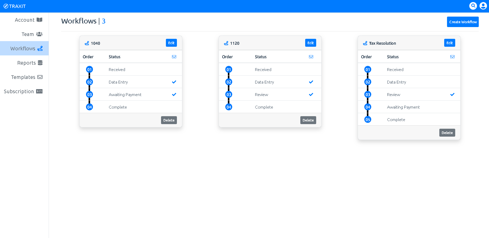

The backbone of this tool is workflows. They are meant to process and track the status of engagements. Essentially they can be used for anything that requires steps to complete but for a CPA firm this might be tax returns, or bookkeeping.

### The Breakdown

* The Workflow Card
    * Each card represents a different workflow. By clicking the "Create Workflow" button on the upper right hand corner, you will be prompted to provide a title for your workflow. You may also use a current workflow already created. Also available is the ability to edit and delete a workflow and its statuses. Note, if engagements are currently using a workflow or its statuses the ability to delete or edit will be limited to prevent any issues from occuring.

* The Workflow Title
    * The title of the workflow can be found at the top left corner of the card. For each type of an engagement that requires a process to complete, we use workflows to manage the process and identify the process we want to use on the engagement by the workflow title.
    For example, the "1040" workflow title represents the process we want to use for 1040 Tax Return engagement.

* The Workflow Statuses
    * Each status inside that workflow represents the current location or task etc.. needed before the engagement can be moved to the next step. Any action taken on the engagement through this workflow will be tracked and recorded for data and history to create better awareness and decesion making going forward. At anytime you can remove or add statuses, along with changing the order however this option will be limited if the status is currently assigned to an active engagement.

* Extending the statuses
    * Extending this feature even further, you will notice a small blue checkmark to the right of some of the statuses. This is used to notify TRAXIT that at this status, prompt the user if they would like to notify the client/customer of the current status of there engagement by email. Double clicking on the status checkmark will allow you to even provide a unique message that will also be sent with the email.